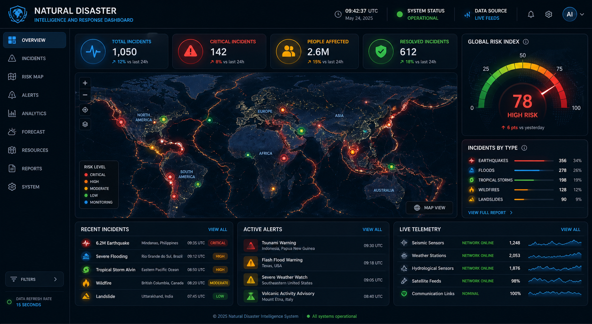
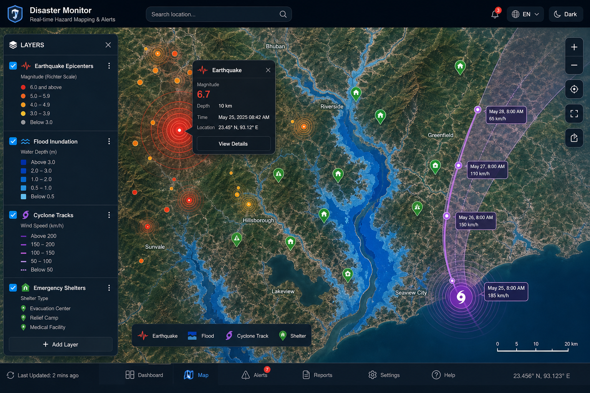
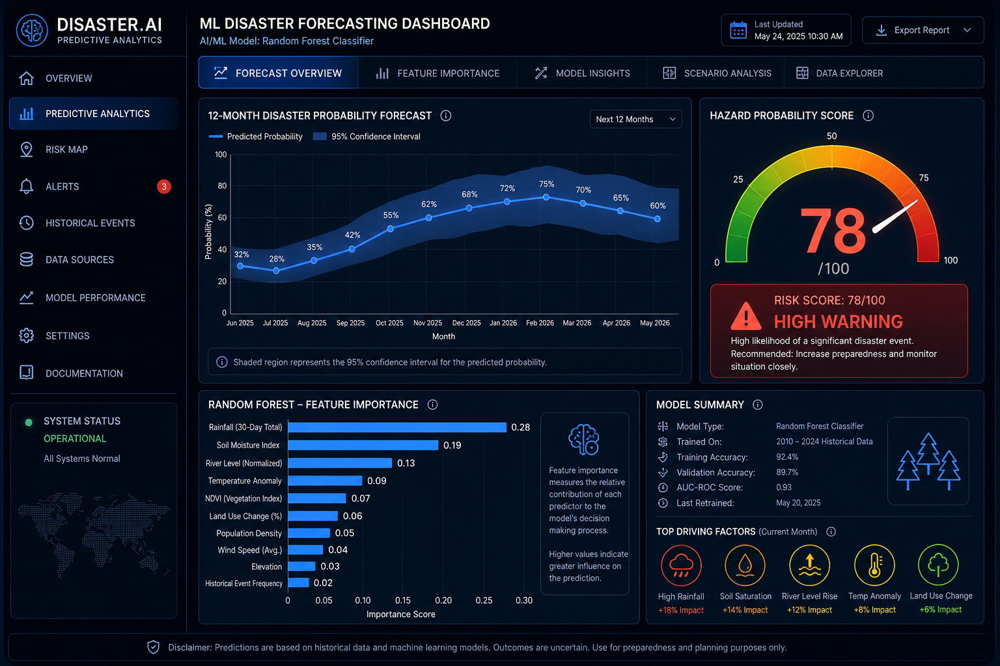
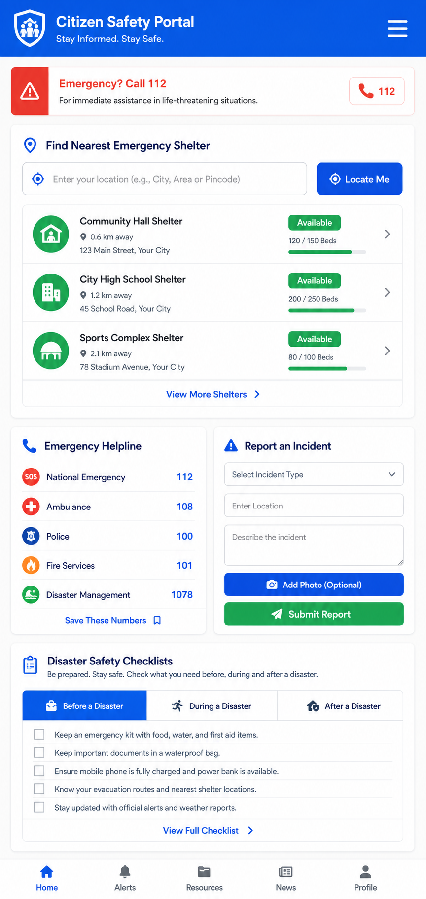

# 🚨 Natural Disaster Intelligence & Emergency Response Dashboard

An advanced, web-based Data Visualization, Predictive Analytics, and Emergency Management System built for B.Tech Data Science academic excellence and real-world citizen impact.



---

## 🌟 Executive Summary

The **Natural Disaster Intelligence Dashboard** integrates real-time satellite and meteorological feeds (USGS, OpenWeatherMap, Open-Meteo) with machine learning models, spatial GIS mapping, and **dynamic user dataset processing**. It bridges the critical gap between raw hazard telemetry, citizen emergency safety, and government rescue operations.

### Key Capabilities:
- **Real-Time Data Integration**: Ingests live USGS earthquake streams and meteorological hydrological data.
- **Custom Dataset Upload & Auto-Dashboards**: Upload any disaster CSV, Excel, or JSON file to automatically clean data, impute missing values, geocode location names, compute hazard risk scores, and build dynamic interactive dashboards.
- **Interactive Spatial Hazard Maps**: Folium heatmaps with dynamic layer toggles for earthquakes, floods, cyclones, and emergency shelter clusters.
- **Predictive Machine Learning**: Random Forest Earthquake Risk predictor, Gradient Boosting Flood Severity engine, and Holt-Winters Time-Series Forecaster with 95% Confidence Intervals.
- **Multi-Role Interfaces**: Dual portals for **Citizens** (shelter finder, incident reporting, emergency contacts, safety checklists) and **Government Authorities** (NDRF team dispatch, asset management, shelter capacity tracking).
- **Automated Early Warning Alerts**: Trigger-based SMS (Twilio) and Email (SMTP) notification engine.
- **Innovative AI Features**: Social media crisis sentiment analysis and graph-based evacuation route optimization.
- **Multi-Language Support**: English, Hindi, Spanish, and French UI localization.

---

## 📤 Custom Dataset Upload & Automated Cleaning Engine

Users can upload their own disaster telemetry files (`.csv`, `.xlsx`, `.json`) directly in **Tab 8**. The system automatically performs:
1. **Semantic Column Detection**: Maps location names, timestamps, physical metrics (magnitude, rainfall, wind speed), casualties, and economic losses.
2. **Location Geocoding**: Translates location names/landmarks into latitude and longitude coordinates automatically.
3. **Automated Risk Index Calculation**: Computes composite hazard risk scores ($0 - 100$) for every record.
4. **Dynamic Dashboards**: Generates instant Folium GIS maps, severity histograms, KPI summaries, and exportable cleaned CSV datasets.

---

## 📸 Interactive Visual Previews

### 1. Executive Dashboard & Real-Time Telemetry

*High-level executive overview featuring real-time KPI cards, peak risk gauges, live incident feeds, and CSV report export capability.*

### 2. Multi-Layer GIS Interactive Hazard Map

*Interactive Folium GIS map featuring seismic heatmaps, magnitude circular rings, flood inundation zones, and emergency shelter occupancy clusters.*

### 3. Machine Learning Predictive Analytics & Time-Series Forecasting

*Random Forest & Gradient Boosting hazard severity calculators with 95% Confidence Interval bands and 12-month Holt-Winters projections.*

### 4. Citizen Emergency Assistance Portal & Shelter Finder

*Location-based shelter finder with Haversine distance search, crowdsourced disaster reporting, emergency helplines, and survival checklists.*

---

## 🏗️ Project Architecture & Folder Structure

```
data_visualization/
├── app.py                      # Main Streamlit Dashboard Application
├── config.py                   # Centralized Configuration & Environment Settings
├── requirements.txt            # Python Dependencies
├── README.md                   # Complete Documentation & Setup Guide
├── PROJECT_REPORT.md           # Formal Academic B.Tech Project Report Outline
├── PRESENTATION.md             # 15-Minute Presentation Script & Slide Deck Outline
├── DEPLOYMENT.md               # Streamlit Cloud & Production Deployment Guide
├── .env.example                # Sample Environment Variables Configuration
├── docs/
│   └── images/                 # Interactive Visual Previews & Diagrams
│       ├── dashboard_banner.png
│       ├── interactive_map_preview.png
│       ├── ml_prediction_chart.png
│       └── citizen_portal_preview.png
├── data/
│   └── disaster_intelligence.db # SQLite Database (Auto-generated & Seeded)
├── src/
│   ├── __init__.py
│   ├── database.py             # Database Schema & SQLite/PostgreSQL Abstraction
│   ├── data_collection.py      # USGS & Weather API Ingestion with Fallbacks
│   ├── data_processing.py      # Hazard Scoring & Custom Dataset Upload Engine
│   ├── ml_models.py            # Random Forest, Gradient Boosting & Time-Series Models
│   ├── visualizations.py       # Folium GIS Maps & Plotly Charts
│   ├── alert_system.py         # Twilio SMS & SMTP Email Dispatcher
│   ├── citizen_features.py     # Shelter Finder (Haversine), Citizen Reporting & Safety
│   ├── government_dashboard.py # NDRF Asset Allocation & Shelter Capacity Controls
│   ├── sentiment_analysis.py   # Crowdsourced Social Media Distress Engine
│   ├── route_optimization.py   # Safe Evacuation Route Optimization (Dijkstra/A*)
│   └── i18n.py                 # Multi-language Translation Engine
├── scripts/
│   └── init_db.py              # Sample Database Seeder (1000+ Earthquakes, 500+ Floods)
└── tests/
    └── test_modules.py         # Pytest Test Suite
```

---

## ⚡ Quick Start & Installation Guide

### Prerequisites
- Python 3.9+ installed
- Git

### 1. Clone & Navigate to Repository
```bash
git clone https://github.com/Jyothika30-2006/data_visualization.git
cd data_visualization
```

### 2. Install Dependencies
```bash
pip install -r requirements.txt
```

### 3. Initialize Database & Seed Historical Records
Generates 1,000+ historical earthquakes, 500+ flood incidents, 200+ cyclones, 50+ emergency shelters, and regional population vulnerability profiles:
```bash
python scripts/init_db.py
```

### 4. Configure API Keys (Optional)
Copy `.env.example` to `.env` and insert your credentials:
```bash
cp .env.example .env
```
*(If API keys are left blank, the application operates seamlessly using high-accuracy fallback simulations and Open-Meteo public endpoints.)*

### 5. Launch the Streamlit Dashboard
```bash
streamlit run app.py
```
Open your browser at `http://localhost:8501` to view the live dashboard.

---

## 📊 Modules & Feature Walkthrough

| Tab Module | Description | Key Tech Stack |
| :--- | :--- | :--- |
| **1. Executive Overview** | High-level KPIs, peak risk gauge, live USGS feed table, CSV report export. | Streamlit, Pandas, Plotly |
| **2. Interactive Hazard Map** | Multi-layer spatial GIS map with risk heatmaps and shelter markers. | Folium, HeatMap, MarkerCluster |
| **3. Historical Trends** | Multi-line time series, severity histograms, and socio-economic impact cards. | Plotly Express & Graph Objects |
| **4. ML Risk Predictions** | Real-time hazard score prediction with 95% Confidence Bounds & 12-Month Forecasts. | Scikit-Learn, Statsmodels |
| **5. Citizen Portal** | Nearest shelter finder via Haversine formula, crowdsourced incident reports, helpline directory. | Geopy, Haversine, SQLite |
| **6. Government Operations** | NDRF team deployment, emergency asset management, shelter occupancy tracker. | Streamlit Forms, Plotly |
| **7. Innovative Tools** | Live social media crisis distress sentiment feed & Safe evacuation route optimizer. | Python Graph Search, Sentiment NLP |
| **8. Upload Custom Dataset** | Drag-and-drop CSV/Excel dataset file upload with automated cleaning & dynamic dashboards. | Pandas, Folium, Plotly |

---

## 🧪 Testing & Validation

Run the automated Pytest suite to verify database schemas, risk algorithms, ML prediction intervals, custom dataset cleaning pipelines, and alert functions:
```bash
pytest tests/test_modules.py
```

---

## 🚀 Deployment Guide
Refer to [DEPLOYMENT.md](DEPLOYMENT.md) for detailed step-by-step instructions on deploying to **Streamlit Cloud** or **Heroku**.

---

## 🎓 Academic Credit & License
Developed for B.Tech Data Science coursework. Distributed under the MIT License.
